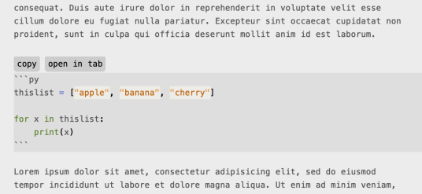

# Markdown Code Exporter

A Sublime Text plugin that adds useful action buttons for handling code blocks in Markdown files.

Currently supported actions:

- __copy__: Copies the code block content to your clipboard.
- __open in tab__: Opens the code block in a new tab with appropriate syntax highlighting.

Screenshot:

(Color scheme in the screenshot comes from MarkdownEditing plugin.)

## Installation

- __Manual installation (zip):__ Download the [zip](https://github.com/SublimeText-Markdown/MarkdownCodeExporter/archive/refs/heads/main.zip) of the repo and extract into `Packages/MarkdownCodeExporter`.
- __Manual installation (git):__ Go to `Packages` folder and `git clone https://github.com/SublimeText-Markdown/MarkdownCodeExporter MarkdownCodeExporter`.
- __Package Control:__ Search for `MarkdownCodeExporter`.

## Usage

The plugin automatically activates when you open a Markdown file. For each fenced code block, you'll see action buttons. The plugin dynamically reacts to your modifications in the file.

## License

[MIT](LICENSE)
